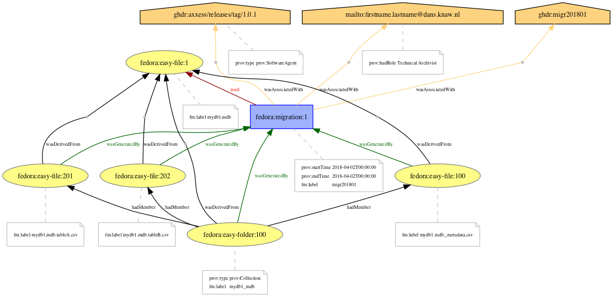

# The provenance model

- [prov00.ipynb](http://nbviewer.jupyter.org/github/DANS-repo/migr201801/blob/master/model/prov/prov00.ipynb) - Preparing the environment for computing [PROV](https://www.w3.org/TR/prov-overview/).
- [prov01.ipynb](http://nbviewer.jupyter.org/github/DANS-repo/migr201801/blob/master/model/prov/prov01.ipynb) - Computing the [PROV](https://www.w3.org/TR/prov-overview/) model for MS Access migration.

---

*Provenance model that can be expressed using RELS-EXT datastreams of Fedora digital objects. The only *extra* digital object required for implementation is the *prov:Activity* `fedora:migration:1`. See [pdf version](migration-prov.pdf) of this image.*